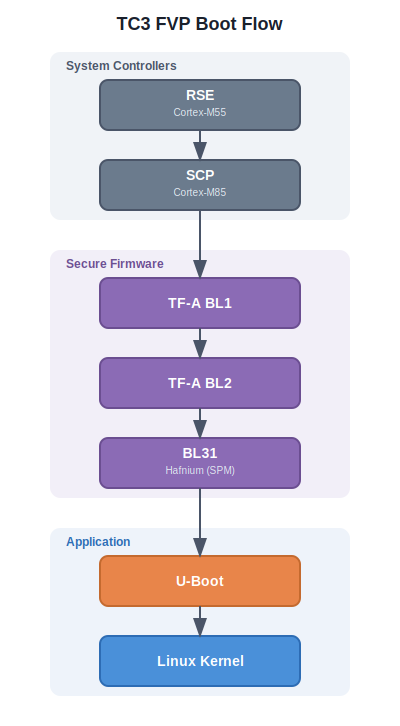

# svg-diagram

A Claude Code skill that generates clean, professional SVG architecture and flow diagrams — no ASCII art, no broken renders.

## What it does

Generates standalone `.svg` files that render cleanly on GitHub, GitLab, and any browser. Supports:

- Architecture diagrams
- Flowcharts
- Sequence diagrams
- Component diagrams
- Boot flow / pipeline visualizations
- Network topology
- Memory maps

## Key features

- **GitHub-safe SVGs** — no `<foreignObject>`, no JavaScript, no external refs
- **Mandatory layered structure** — separates background, containers, nodes, labels, and connections into distinct `<g>` layers. Connections always render last so arrows are never hidden behind boxes.
- **Layout-first planning** — 5-step process (inventory → grid → size-to-text → route connections → canvas size) computed before any SVG is written
- **Built-in validation** — Python script checks for box overlaps, text overflow, arrow-through-box, arrow-through-text, missing markers, tight spacing, viewbox mismatch, grid misalignment, and layer structure violations
- **Free color choice** — no fixed palette; just ensure contrast, consistency within a diagram, and stroke-fill cohesion

## SVG layer architecture

Every generated diagram follows this mandatory layer order:

```
<defs>           — markers, gradients, filters
#background      — canvas fill
#containers      — group/zone background rects
#nodes           — component boxes
#labels          — all text elements
#connections     — all arrows (MUST be last)
```

Nodes and edges are never interleaved. The validator enforces this.

## Validation

After generating any SVG, the skill runs `scripts/validate_svg.py` to catch layout issues:

```bash
python3 scripts/validate_svg.py <file.svg> --verbose
python3 scripts/validate_svg.py <directory>          # batch validate
```

**Checks performed:**

| Check | Severity | What it catches |
|-------|----------|-----------------|
| `layer-structure` | warning | No layered `<g>` groups |
| `layer-order` | error | Layers in wrong order |
| `layer-violation` | error | Arrows in `#nodes` or rects in `#connections` |
| `box-overlap` | error | Two content boxes occupy the same space |
| `text-overflow` | error | Text extends beyond its containing box |
| `text-overlap` | error | Two text elements overlap each other |
| `arrow-through-box` | error | Arrow passes through an unrelated box |
| `arrow-through-text` | error | Arrow passes through a text label area |
| `arrow-endpoint` | warning | Arrow doesn't start/end at box edge |
| `missing-marker` | error | Arrowhead referenced but not defined |
| `tight-spacing` | warning | Boxes closer than 30px edge-to-edge |
| `viewbox` | error/warn | Canvas doesn't match content bounds |
| `grid-alignment` | warning | Boxes at nearly-same positions (misaligned) |
| `short-arrow` | warning | Arrow too short for arrowhead to render |

**Exit codes:** 0 = pass, 1 = warnings only, 2 = errors found

## Install

### Via plugin marketplace (recommended)

```bash
# Add as a marketplace source
/plugin marketplace add pkt-lab/svg-diagram

# Then install
/plugin install svg-diagram@pkt-lab-svg-diagram
```

After installing as a plugin, the skill is available as `/svg-diagram:svg-diagram`.

### Via git clone + symlink

```bash
git clone https://github.com/pkt-lab/svg-diagram.git ~/svg-diagram
ln -sfn ~/svg-diagram/skills/svg-diagram ~/.claude/skills/svg-diagram
```

### Manual

Copy `skills/svg-diagram/SKILL.md` to `~/.claude/skills/svg-diagram/SKILL.md`.

## Usage

Invoke explicitly:
```
/svg-diagram Draw the boot flow from RSE → SCP → TF-A → U-Boot → Linux
```

Or just ask naturally — the skill auto-triggers on "draw", "visualize", "diagram", "illustrate":
```
Can you draw an architecture diagram of our microservices?
```

## Example output



## License

MIT
