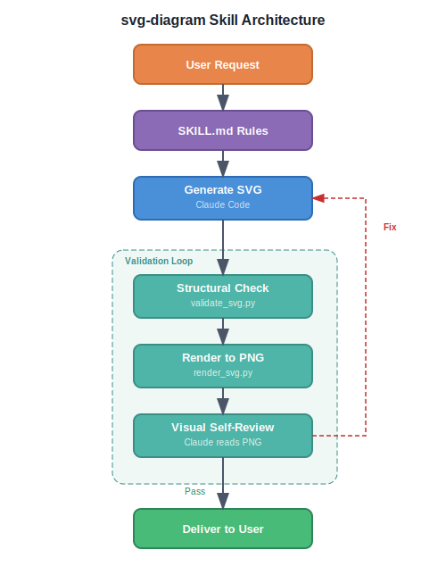

# svg-diagram

A Claude Code skill that generates clean, professional SVG architecture and flow diagrams — no ASCII art, no broken renders.

## What it does

Generates standalone `.svg` files that render cleanly on GitHub, GitLab, and any browser. Supports architecture diagrams, flowcharts, sequence diagrams, component diagrams, boot flow / pipeline visualizations, network topology, and memory maps.

## How it works



The skill uses a closed-loop pipeline:

1. **Plan layout** — 5-step process (inventory → grid → size-to-text → route connections → canvas size) before writing any SVG
2. **Generate SVG** — mandatory layered structure with connections rendered last
3. **Structural validation** — `validate_svg.py` checks for overlaps, text overflow, arrow routing, layer violations, and more
4. **Visual self-review** — `render_svg.py` converts SVG to PNG, Claude reads the image and checks for aesthetic issues
5. **Fix loop** — if either check fails, edit and re-validate until clean

## Key features

- **GitHub-safe SVGs** — no `<foreignObject>`, no JavaScript, no external refs
- **Layered SVG structure** — `<defs>` → `#background` → `#containers` → `#nodes` → `#labels` → `#connections`. Connections always render last so arrows are never hidden behind boxes.
- **Structural validation** — 14 automated checks catch box overlaps, text overflow, arrow-through-box, arrow-through-text, missing markers, tight spacing, viewbox mismatch, grid misalignment, and layer violations
- **Visual self-review** — SVG→PNG rendering via librsvg+cairo, Claude reads the PNG to catch aesthetic issues the structural validator can't
- **Free color choice** — no fixed palette; just ensure contrast, consistency within a diagram, and stroke-fill cohesion

## Validation

```bash
python3 scripts/validate_svg.py <file.svg> --verbose   # structural checks
python3 scripts/validate_svg.py <directory>             # batch validate
python3 scripts/render_svg.py <file.svg>                # render to PNG for visual review
```

**Exit codes:** 0 = pass, 1 = warnings only, 2 = errors found

## Install

### Via plugin marketplace (recommended)

```bash
/plugin marketplace add pkt-lab/svg-diagram
/plugin install svg-diagram@pkt-lab-svg-diagram
```

### Via git clone + symlink

```bash
git clone https://github.com/pkt-lab/svg-diagram.git ~/svg-diagram
ln -sfn ~/svg-diagram/skills/svg-diagram ~/.claude/skills/svg-diagram
```

### Manual

Copy `skills/svg-diagram/SKILL.md` to `~/.claude/skills/svg-diagram/SKILL.md`.

## Usage

Invoke explicitly:
```
/svg-diagram Draw the boot flow from RSE → SCP → TF-A → U-Boot → Linux
```

Or just ask naturally — the skill auto-triggers on "draw", "visualize", "diagram", "illustrate":
```
Can you draw an architecture diagram of our microservices?
```

## License

MIT
